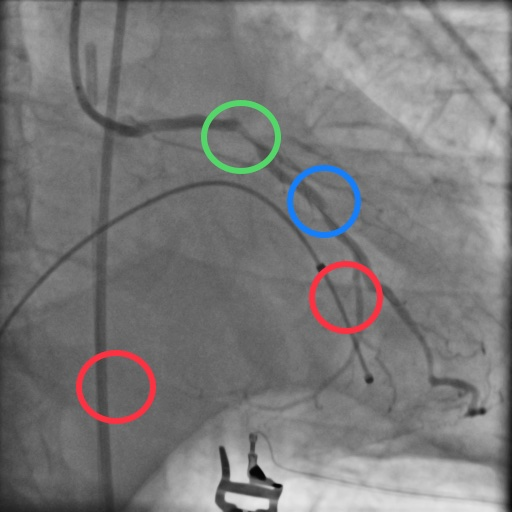
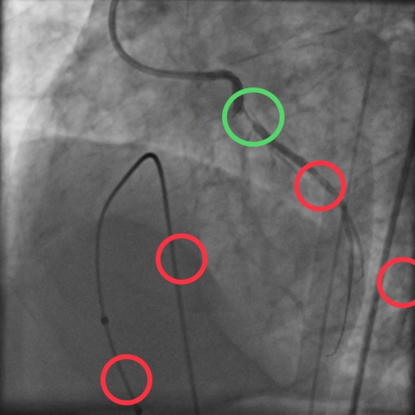

# Stenosis Detection Final Project of Computer Vision (Biomedical Images) Course

The final project of the graduate course in computer vision with biomedical images.
 This project is a deep learning approach for biomedical purposes of stenosis detection. We fine-tuned a YOLO NN using the Roboflow tool with images of stenosis and non-stenosis patches.
 
 ## Example of the detection
 

 

